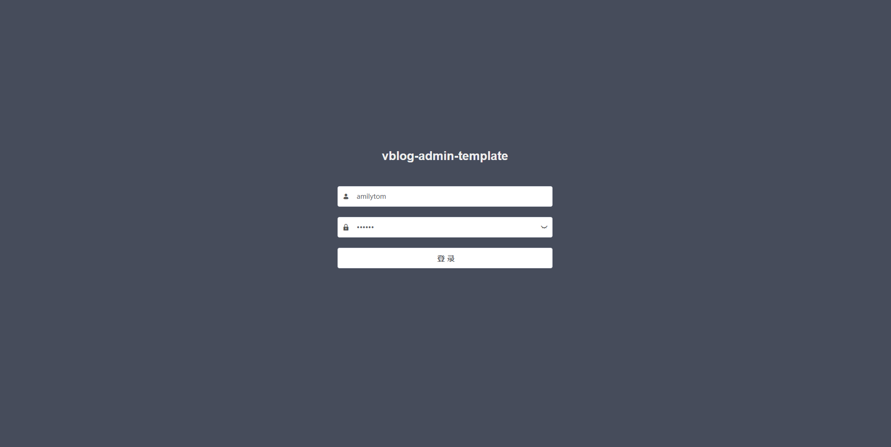
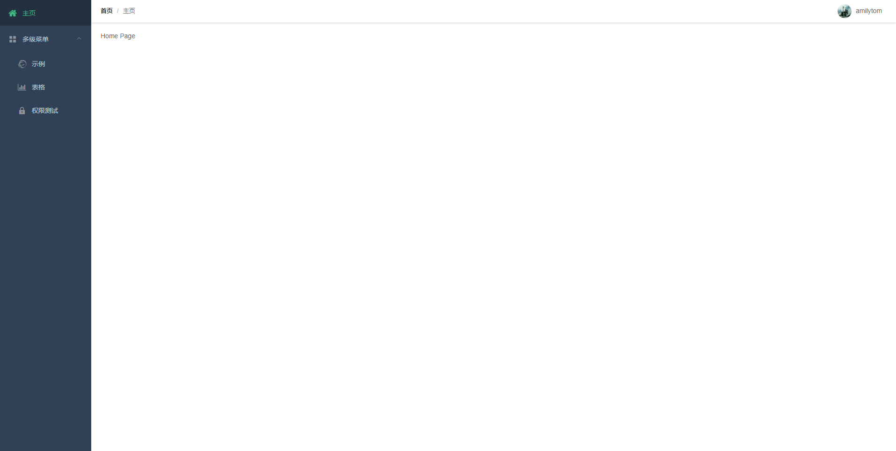
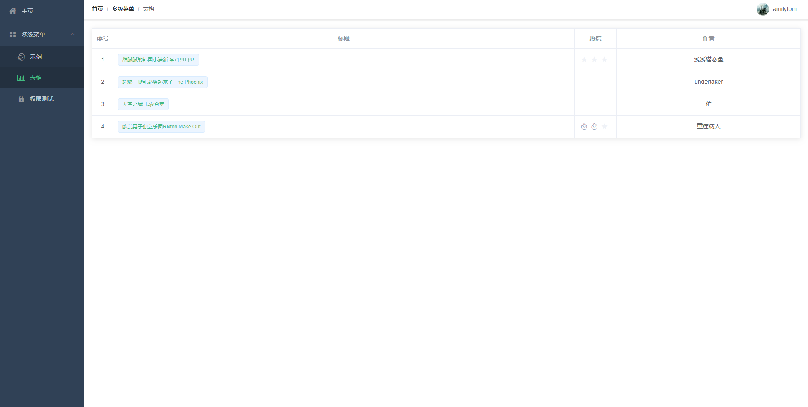

# vblog-admin-template

> VUE后台管理系统基础模板
该模板是根据uncleLian的vue-blog（https://github.com/uncleLian/vue-blog-template/tree/v1.0）基础模板修改而来。

该模板可以作为 vue-cli2 搭建的后台基础模板。

## 更新日志
- 调整目录结构views(页面)/components(组件)/utils(全局方法);
- 封装axios,设置api代理（为mockjs模拟正常，已注释）;
- main.js去掉多余axios调用;
- 使用时删除mock目录。

## 基础功能
- 登录/注销
- 权限验证（页面级）
- 动态侧边栏
- 动态面包屑
- 导航标签
- 401、404、全局错误捕捉
- element-ui
- axios 封装（统一处理请求、拦截、报错等）
- cache 封装

## 安装运行

``` bash
# 安装依赖
npm install

# 启动服务
npm run dev

# 打包发布
npm run build
```

## 运行结果




